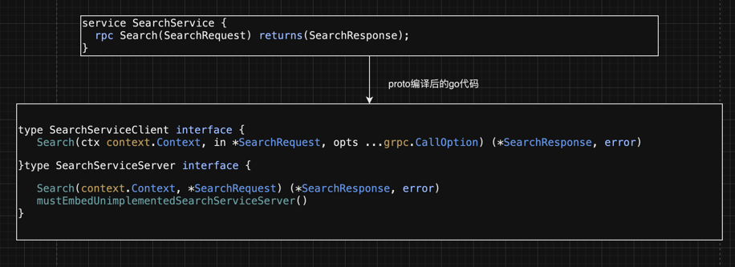
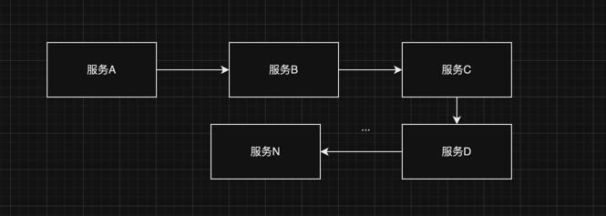

# high-end-lines

### protobuf基础

#### 1、grpc与protobuf的关系

    a、grpc使用protobuf作为序列化协议，protobuf是跨语言的。
    b、grpc使用http2.0协议，http2.0相比于http1.x大幅提高了web性能。

#### 2、protobuf基础

    a.序列化协议，跨平台，跨语言，其他的序列化协议json、xml等。
    b.本身并不与grpc绑定。

#### 3、IDL

```protobuf
syntax = "proto3";
message SearchRequest {//注释
  string query = 1; //string：字段类型；query：字段名；1：字段编号
  int32 page_num = 2; //字段名推荐下划线分割
  repeated string snippets = 3; //repeated：字段规则
  reserved "foo", "bar"; //reserved：保留字段；指定字段序号：reserved 2, 5 to 10, 15; 表示2和5到10和15是保留序号。
}
```

```
字段规则：
    a.singular：未指定字段规则，则是默认字段规则。
    b.optional：与singular相同。
    c.repeated：重复零次或多次，保留重复顺序。
    d.map：成对的键值对字段。
    e.保留字段:避免再次用到已经移除的字段可以设置保留字段。任何未来用户尝试使用这些字段，协议缓冲区编译器就会报错。既可以指定字段名也可以制定字段序号。
```

#### 标量类型

```
.proto Type     Go Type	Notes
double	        float64	
float	        float32	
int32	        int32	使用可变长度的编码。对负数的编码效率低下 - 如果您的字段可能包含负值，请改用 sint32。
int64	        int64	使用可变长度的编码。对负数的编码效率低下 - 如果字段可能有负值，请改用 sint64。
uint32	        uint32	使用可变长度的编码。
uint64	        uint64	使用可变长度的编码。
sint32	        int32	使用可变长度的编码。有符号整数值。与常规 int32 相比，这些函数可以更高效地对负数进行编码。
sint64	        int64	使用可变长度的编码。有符号整数值。与常规 int64 相比，这些函数可以更高效地对负数进行编码。
fixed32         uint32	始终为 4 个字节。如果值通常大于 2^28，则比 uint32 更高效。
fixed64	        uint64	始终为 8 个字节。如果值通常大于 2^56，则比 uint64 更高效。
sfixed32        int32	始终为 4 个字节。
sfixed64        int64	始终为 8 个字节。
bool	        bool	
string	        string	字符串必须始终包含 UTF-8 编码或 7 位 ASCII 文本，并且长度不得超过 232。
bytes	        []byte	可以包含任意长度的 2^32 字节。
```

#### 复合类型

```protobuf
syntax = "proto3";
message SearchResponse {
  repeated Result results = 1;
}

message Result {
  string url = 1;
  string title = 2;
  repeated string snippets = 3;
}
```

#### 枚举

```protobuf
syntax = "proto3";
message SearchRequest {
  string query = 1;
  int32 page_num = 2;
  int32 page_size = 3;
  enum Corpus {
    Universal = 0;
    Web = 1;
    Images = 2;
    Local = 3;
  }
  Corpus corpus = 4;
}
```

#### 服务

```protobuf
syntax = "proto3";

service SearchService {
  rpc Search(SearchRequest) returns(SearchResponse);
}

message Result {
  string url = 1;
  string title = 2;
  repeated string snippets = 3;
}

message SearchResponse {
  repeated Result results = 1;
}

message SearchRequest {
  string query = 1;
  int32 page_num = 2;
  int32 page_size = 3;
  enum Corpus {
    Universal = 0;
    Web = 1;
    Images = 2;
    Local = 3;
  }
  Corpus corpus = 4;
}
```

#### 使用其他消息类型

```protobuf
syntax = "proto3";

import "google/protobuf/wrappers.proto";

package ecommerce;

message Order {
  string id = 1;
  repeated string items = 2;
  string desc = 3;
  float price = 4;
  google.protobuf.StringValue destination = 5;
}
```

#### protoc使用

##### 安装

```shell
MacOS
   brew isntall protobuf
   protoc --version
```

##### 使用

```shell
    protoc --help
```

```
Usage: protoc [OPTION] PROTO_FILES

  -IPATH, --proto_path=PATH   指定搜索路径
  --plugin=EXECUTABLE:
  
  ....
 
  --cpp_out=OUT_DIR           Generate C++ header and source.
  --csharp_out=OUT_DIR        Generate C# source file.
  --java_out=OUT_DIR          Generate Java source file.
  --js_out=OUT_DIR            Generate JavaScript source.
  --objc_out=OUT_DIR          Generate Objective C header and source.
  --php_out=OUT_DIR           Generate PHP source file.
  --python_out=OUT_DIR        Generate Python source file.
  --ruby_out=OUT_DIR          Generate Ruby source file
  
   @<filename>                proto文件的具体位置
```

##### golang插件

    非内置的预言支持需要安装单独的预言插件，比如--go_out= 对应的是protoc-gen-go，安装命令如下

```shell
最新版：
go install google.golang.org/protobuf/cmd/protoc-gen-go@latest
指定版本：
go install google.golang.org/protobuf/cmd/protoc-gen-go@v1.3.0
```

生成代码命令

```shell
protoc --proto_path=src --go_out=out --go_opt=paths=source_relative foo.proto bar/baz.proto
```

###### 注意：protoc-gen-go要求pb文件必须指定go包的路径，即：

```protobuf
option go_package = "liangwt/note/grpc/example/ecommerce";
```

###### --go_out

指定go代码生成的基本路径

###### --go_opt：设定插件参数

protoc-gen-go提供了 --go_opt 来为其指定参数，并可以设置多个

1. 如果使用 paths=import , 生成的文件会按go_package路径来生成，当然是在--go_out目录下，即
   $go_out/$go_package/pb_filename.pb.go
2. 如果使用 paths=source_relative ， 就在当前pb文件同路径下生成代码。注意pb的目录也被包含进去了。即
   $go_out/$pb_filedir/$pb_filename.pb.go

###### grpc go插件

在google.golang.org/protobuf中，protoc-gen-go纯粹用来生成pb序列化相关的文件，不再承载gRPC代码生成功能,生成gRPC相关代码需要安装grpc-go相关的插件protoc-gen-go-grpc

```shell
go install google.golang.org/grpc/cmd/protoc-gen-go-grpc@latest
```

执行code gen命令

```shell
protoc --go_out=. --go_opt=paths=source_relative \
    --go-grpc_out=. --go-grpc_opt=paths=source_relative \
    routeguide/route_guide.proto
```

###### --go-grpc_out

指定grpc go代码生成的基本路径
命令会产生如下文件

1. route_guide.pb.go, protoc-gen-go的产出物，包含所有类型的序列化和反序列化代码
2. route_guide_grpc.pb.go, protoc-gen-go-grpc的产出物，包含
    + 定义在 SearchService service中的用来给client调用的接口定义
    + 定义在 SearchService service中的用来给服务端实现的接口定义

###### --go-grpc_opt

和protoc-gen-go类似，protoc-gen-go-grpc提供 --go-grpc_opt 来指定参数，并可以设置多个

##### Buf 工具

可以看到使用protoc的时候，当使用的插件逐渐变多，插件参数逐渐变多时，命令行执行并不是很方便和直观。

###### 初始化模块

在pb文件的根目录执行，为这个pb目录创建一个buf的模块。此后便可以使用buf的各种命令来管理这个buf模块了

```shell
buf mod init
```

此时会在根目录多出一个buf.yaml文件，内容为:

```yaml
# buf.yaml
version: v1
breaking:
  use:
    - FILE
lint:
  use:
    - DEFAULT
```

###### Lint pb文件

### 通信模式

```protobuf
syntax = "proto3";

package ecommerce;

import "google/protobuf/wrappers.proto";

option go_package = "ecommerce/";

message Order {
  string id = 1;
  repeated string items = 2;
  string description = 3;
  float price = 4;
  string destination = 5;
}

service OrderManagement {
  rpc getOrder(google.protobuf.StringValue) returns (Order);
}
```

##### 定义如上的 idl，需要关注几个事项

+ 使用protobuf最新版本syntax = "proto3";
+ protoc-gen-go要求 pb 文件必须指定 go 包的路径。即option go_package = "ecommerce/";
+ 定义的method仅能有一个入参和出参数。如果需要传递多个参数需要定义成message
+ 使用import引用另外一个文件的 pb。google/protobuf/wrappers.proto是 google 内置的类型

##### server 实现

1. 由 pb 文件生成的 gRPC 代码中包含了 service 的接口定义，它和我们定义的 idl 是吻合的

```protobuf
syntax = "proto3";

import "google/protobuf/wrappers.proto";

message Order {
  string id = 1;
  repeated string items = 2;
  string desc = 3;
  float price = 4;
  google.protobuf.StringValue destination = 5;
}
service OrderManagement {
  rpc getOrder(google.protobuf.StringValue) returns (Order);
}
```

##### 我们的业务逻辑就是实现这个接口

```go
package service

import (
	"context"
	"fmt"
	pb "high-end-lines/internal/grpc/proto/proto_go"
)

var _ pb.SearchServiceServer = &SearchServiceImpl{}

type SearchServiceImpl struct {
	pb.UnimplementedSearchServiceServer
}

func (s *SearchServiceImpl) Search(ctx context.Context, req *pb.SearchRequest) (*pb.SearchResponse, error) {
	fmt.Println("Search exec...", "request", req)
	return &pb.SearchResponse{
		Results: []*pb.Result{
			{
				Url:      "www.baidu.com",
				Title:    "baidu",
				Snippets: []string{"牛", "羊"},
			},
		},
	}, nil
}

```

##### 在实现完业务逻辑之后，我们可以创建并启动服务

```go
package main

import (
	"fmt"
	"google.golang.org/grpc"
	pb "high-end-lines/internal/grpc/proto/proto_go"
	"high-end-lines/internal/service"
	"net"
)

func main() {
	s := grpc.NewServer()

	pb.RegisterSearchServiceServer(s, &service.SearchServiceImpl{})

	lis, err := net.Listen("tcp", ":8009")
	if err != nil {
		fmt.Println("net.Listen err", err)
		panic(err)
	}

	if err := s.Serve(lis); err != nil {
		fmt.Println("Serve err", err)
		panic(err)
	}
}
```

###### 客户端实现

```go
package main

import (
	"context"
	"fmt"
	"google.golang.org/grpc"
	pb "high-end-lines/internal/grpc/proto/proto_go"
	"log"
	"time"
)

func main() {
	conn, err := grpc.Dial("127.0.0.1:8009", grpc.WithInsecure())
	if err != nil {
		panic(err)
	}
	defer conn.Close()

	client := pb.NewSearchServiceClient(conn)

	ctx, cancel := context.WithTimeout(context.Background(), time.Second)
	defer cancel()

	// Get Order
	retrievedOrder, err := client.Search(ctx, &pb.SearchRequest{
		PageNum:  1,
		Query:    "1",
		PageSize: 10,
	})
	if err != nil {
		fmt.Println("client.Search err", err)
		return
	}

	log.Print("GetOrder Response -> : ", retrievedOrder)
}
```

###### 小总结

对于上面介绍的的这种类似于http1.x的模式：客户端发送请求，服务端响应请求，一问一答的模式在 gRPC 里叫做Simple RPC (也称Unary
RPC)。gRPC 同时也支持其他类型的交互方式

##### Bidirectional-Streaming RPC 双向流式 RPC

双向流式 RPC，顾名思义是双向流。由客户端以流式的方式发起请求，服务端同样以流式的方式响应请求
首个请求一定是 Client 发起，但具体交互方式（谁先谁后、一次发多少、响应多少、什么时候关闭）根据程序编写的方式来确定（可以结合协程）
假设该双向流是按顺序发送的话，大致如图：

```protobuf
syntax = "proto3";

package ecommerce;

option go_package = "ecommerce/";

import "google/protobuf/wrappers.proto";

message Order {
  string id = 1;
  repeated string items = 2;
  string description = 3;
  float price = 4;
  string destination = 5;
}

message CombinedShipment {
  string id = 1;
  string status = 2;
  repeated Order orderList = 3;
}

service OrderManagement {
  rpc processOrders(stream google.protobuf.StringValue)
      returns (stream CombinedShipment);
}
```

###### server 实现

1. 函数入参OrderManagement_ProcessOrdersServer是用来写入多个响应和读取多个消息的对象引用
2. 可以通过调用这个流对象的Send(...)，来往这个对象写入响应
3. 可以通过调用这个流对象的Recv(...)函数读取消息，当Recv返回io.EOF代表流已经结束
4. 通过返回nil或者error表示全部数据写完了

```go
package service

import (
	"fmt"
	pb "high-end-lines/internal/grpc/proto/proto_go"
	"io"
	"log"
)

var _ pb.SearchServiceServer = &SearchServiceImpl{}

var orderBatchSize int = 1

type OrderServiceImpl struct {
	pb.UnimplementedOrderManagementServer
}

func (s *OrderServiceImpl) ProcessOrders(stream pb.OrderManagement_ProcessOrdersServer) error {

	batchMarker := 1
	var combinedShipmentMap = make(map[string]pb.CombinedShipment)
	for {
		orderId, err := stream.Recv()
		log.Printf("Reading Proc order : %s", orderId)
		if err == io.EOF {
			log.Printf("EOF : %s", orderId)
			for _, combinedShipment := range combinedShipmentMap {
				if err := stream.Send(&combinedShipment); err != nil {
					fmt.Println("EOF Send err", err)
					return err
				}
			}
			return nil
		}
		if err != nil {
			log.Println(err)
			return err
		}

		shipment, found := combinedShipmentMap[orderId.GetValue()]

		if found {
			shipment.OrderList = append(shipment.OrderList, &pb.Order{Id: orderId.GetValue()})
			combinedShipmentMap[orderId.GetValue()] = shipment
		} else {
			comShip := pb.CombinedShipment{Id: orderId.GetValue(), Status: "Processed!"}
			comShip.OrderList = append(shipment.OrderList, &pb.Order{Id: orderId.GetValue()})
			combinedShipmentMap[orderId.GetValue()] = comShip
			log.Println("len ->", len(comShip.OrderList), comShip.GetId())
		}

		if batchMarker == orderBatchSize {
			for _, comb := range combinedShipmentMap {
				log.Printf("Shipping : %v -> %v", comb.Id, len(comb.OrderList))
				if err := stream.Send(&comb); err != nil {
					return err
				}
			}
			batchMarker = 0
			combinedShipmentMap = make(map[string]pb.CombinedShipment)
		} else {
			batchMarker++
		}
	}
}
```

##### client实现

```go
package main

import (
	"context"
	"google.golang.org/grpc"
	"google.golang.org/protobuf/types/known/wrapperspb"
	pb "high-end-lines/internal/grpc/proto/proto_go"
	"io"
	"log"
)

func main() {
	conn, err := grpc.Dial("127.0.0.1:8009", grpc.WithInsecure())
	if err != nil {
		panic(err)
	}
	defer conn.Close()

	c := pb.NewOrderManagementClient(conn)
	ctx, cancelFn := context.WithCancel(context.Background())
	defer cancelFn()

	stream, err := c.ProcessOrders(ctx)
	if err != nil {
		panic(err)
	}

	go func() {
		if err := stream.Send(&wrapperspb.StringValue{Value: "101"}); err != nil {
			panic(err)
		}

		if err := stream.Send(&wrapperspb.StringValue{Value: "102"}); err != nil {
			panic(err)
		}

		if err := stream.CloseSend(); err != nil {
			panic(err)
		}
	}()

	for {
		combinedShipment, err := stream.Recv()
		if err == io.EOF {
			break
		}
		log.Println("Combined shipment : ", combinedShipment.OrderList)
	}
}

```

双向流相对还是比较复杂的，大部分场景都是使用事件机制进行异步交互，需要精心的设计

### 拦截器

gRPC的拦截器和其他框架的拦截器（也称middleware）作用是一样的。利用拦截器我们可以在不侵入业务逻辑的前提下修改或者记录服务端或客户端的请求与响应，利用拦截器我们可以实现诸如日志记录、权限认证、限流等诸多功能

拦截器分为两种：unary interceptors和streaming interceptors
，两种拦截器可以分别应用在服务端和客户端，所以gRPC总共为我们提供了四种拦截器。它们已经被定义成了go中的接口，我们创建的拦截器只要实现这些接口即可

#### 服务端拦截器

服务端的拦截器从请求开始按顺序执行拦截器，在执行完对应RPC的逻辑之后，再按反向的顺序执行拦截器中对响应的处理逻辑

##### unary interceptors

对于unary服务的拦截器只需实现UnaryServerInterceptor接口即可

```go
func(ctx context.Context, req interface{},
info *UnaryServerInfo, handler UnaryHandler) (resp interface{}, err error)
```

1. ctx context.Context：单个请求的上下文
2. req interface{}：RPC服务的请求结构体
3. info *UnaryServerInfo：RPC的服务信息
4. handler UnaryHandler：它包装了服务实现，通过调用它我们可以完成RPC并获取到响应

###### 示例

```go
package middlewire

import (
	"context"
	"fmt"
	"google.golang.org/grpc"
	"time"
)

// OrderUnaryServerInterceptor 实现 unary interceptors
func OrderUnaryServerInterceptor(ctx context.Context, req interface{}, info *grpc.UnaryServerInfo, handler grpc.UnaryHandler) (resp interface{}, err error) {

	// Pre-processing logic
	s := time.Now()

	// Invoking the handler to complete the normal execution of a unary RPC.
	m, err := handler(ctx, req)

	// Post processing logic
	fmt.Printf("Method: %s, req: %s, resp: %s, latency: %s\n",
		info.FullMethod, req, m, time.Now().Sub(s))

	return m, err
}

```

##### streaming interceptors

对于stream服务的拦截器只要实现StreamServerInterceptor接口即可。它适用于我们上一篇介绍的

1. 服务器端流式 RPC
2. 客户端流式 RPC
3. 双向流式 RPC

```go
func(srv interface{}, ss ServerStream,
info *StreamServerInfo, handler StreamHandler) error
```

1. srv interface{}：服务实现
2. ss ServerStream：服务端视角的流。怎么理解呢？无论是哪一种流式RPC对于服务端来说发送（SendMsg）就代表着响应数据，接收（RecvMsg）就代表着请求数据，不同的流式RPC的区别就在于是多次发送数据（服务器端流式
   RPC）还是多次接收数据（客户端流式 RPC）或者两者均有（双向流式 RPC）。因此仅使用这一个抽象就代表了所有的流式RPC场景
3. info *StreamServerInfo：RPC的服务信息
4. handler StreamHandler：它包装了服务实现，通过调用它我们可以完成RPC

###### 示例

```go
package middlewire

import (
	"google.golang.org/grpc"
	"log"
	"time"
)

func OrderStreamServerInterceptor(srv interface{},
	ss grpc.ServerStream, info *grpc.StreamServerInfo, handler grpc.StreamHandler) error {

	// Pre-processing logic
	s := time.Now()

	// Invoking the StreamHandler to complete the execution of RPC invocation
	err := handler(srv, ss)

	// Post processing logic
	log.Printf("Method: %s, latency: %s\n", info.FullMethod, time.Now().Sub(s))

	return err
}
```

1. srv interface{}:服务实现（就是示例RegisterOrderManagementServer中的&OrderManagementImpl{})
2. ss grpc.ServerStream:服务端发送和接收数据的接口，注意它是一个接口
3. info *grpc.StreamServerInfo包含三个字段： FullMethod是请求的method名字（例如/ecommerce.OrderManagement/updateOrders)；
   IsClientStream 是否是客户端流 IsServerStream 是否是服务端流
4. handler包装了服务实现:所以在调用它之前我们可以进行改写数据流、记录逻辑开始时间等操作,调用完handler即完成了RPC，因为是流式调用所以不会返回响应数据，只有error

###### 流式拦截器既没有请求字段，handler也不会返回响应，该如何记录、修改请求响应呢？

如果想劫持流数据，答案就在ss
ServerStream。再重复一遍它的含义：服务端视角的流，它是一个接口。无论是哪一种流式RPC对于服务端来说发送（SendMsg）就代表着响应数据，接收（RecvMsg）就代表着请求数据，不同的流式RPC的区别就在于是多次发送数据（服务器端流式
RPC）还是多次接收数据（客户端流式 RPC）或者两者均有（双向流式 RPC）。因此可以对ss进行包装，只要传入handler的类型实现ServerStream即可

```go
// SendMsg method call.
package middlewire

import (
	"google.golang.org/grpc"
	"log"
	"time"
)

// SendMsg method call.
type wrappedStream struct {
	Recv []interface{}
	Send []interface{}
	grpc.ServerStream
}

func (w *wrappedStream) RecvMsg(m interface{}) error {
	err := w.ServerStream.RecvMsg(m)

	w.Recv = append(w.Recv, m)

	return err
}

func (w *wrappedStream) SendMsg(m interface{}) error {
	err := w.ServerStream.SendMsg(m)

	w.Send = append(w.Send, m)

	return err
}

func newWrappedStream(s grpc.ServerStream) *wrappedStream {
	return &wrappedStream{
		make([]interface{}, 0),
		make([]interface{}, 0),
		s,
	}
}

func OrderDoubleStreamServerInterceptor(srv interface{},
	ss grpc.ServerStream, info *grpc.StreamServerInfo, handler grpc.StreamHandler) error {

	// Pre-processing logic
	s := time.Now()

	// Invoking the StreamHandler to complete the execution of RPC invocation
	nss := newWrappedStream(ss)
	err := handler(srv, nss)

	// Post processing logic
	log.Printf("Method: %s, req: %+v, resp: %+v, latency: %s\n",
		info.FullMethod, nss.Recv, nss.Send, time.Now().Sub(s))

	return err
}

```

#### 客户端拦截器

客户端拦截器和服务端拦截器类似，从请求开始按顺序执行拦截器，在获取到服务端响应之后，再按反向的顺序执行拦截器中对响应的处理逻辑

##### unary interceptors

client端要实现UnaryClientInterceptor接口实现的接口如下

```
func(ctx context.Context, method string, req, reply interface{}, 
     cc *ClientConn, invoker UnaryInvoker, opts ...CallOption) error
```

你可以在调用远程函数前拦截RPC，通过获取RPC相关信息，如参数，上下文，函数名，请求等，你甚至可以修改原始的远程调用

1. ctx context.Context：单个请求的上下文
2. method string：请求的method名字（例如/ecommerce.OrderManagement/getOrder)
3. req, reply interface{}：请求和响应数据
4. cc *ClientConn：客户端与服务端的链接
5. invoker UnaryInvoker：通过调用它我们可以完成RPC并获取到响应
6. opts ...CallOption：RPC调用的所有配置项，包含设置到conn上的，也包含配置在每一个调用上的

###### 示例

```go
package main

import (
	"context"
	"google.golang.org/grpc"
	"google.golang.org/protobuf/types/known/wrapperspb"
	pb "high-end-lines/internal/grpc/proto/proto_go"
	"io"
	"log"
	"time"
)

func orderUnaryClientInterceptor(ctx context.Context, method string, req, reply interface{},
	cc *grpc.ClientConn, invoker grpc.UnaryInvoker, opts ...grpc.CallOption) error {
	// Pre-processor phase
	s := time.Now()

	// Invoking the remote method
	err := invoker(ctx, method, req, reply, cc, opts...)

	// Post-processor phase
	log.Printf("method: %s, req: %s, resp: %s, latency: %s\n",
		method, req, reply, time.Now().Sub(s))

	return err
}

```

1. cc *grpc.ClientConn客户端与服务端的链接:这里的cc就是示例代码中c := pb.NewOrderManagementClient(conn)的conn
2. invoker grpc.UnaryInvoker包装了服务实现:调用完invoker即完成了RPC，所以我们可以改写req或者在获取到reply之后修改响应

##### streaming interceptors

要实现的接口StreamClientInterceptor

```
func(ctx context.Context, desc *StreamDesc, cc *ClientConn, 
     method string, streamer Streamer, opts ...CallOption) (ClientStream, error)
```

和serve端类似的参数类似，重点关注下面几个参数

1. cs ClientStream：客户端视角的流。类比服务端的ss
   ServerStream，无论是哪一种流式RPC对于客户端来说发送（SendMsg）就代表着请求数据，接收（RecvMsg）就代表着响应数据（正好和服务端是反过来的）
2. streamer Streamer：完成RPC请求的调用

###### 如何记录或者修改流拦截器的请求响应数据？

和服务端stream interceptor同样的道理，通过包装ClientStream即可做到

### 生态

除了可以自己实现拦截器外，gRPC生态也提供了一系列的开源的拦截器可供使用，覆盖权限、日志、监控等诸多方面

```
https://github.com/grpc-ecosystem/go-grpc-middleware
```

### 错误处理

#### 基本错误处理

首先回顾下pb文件和生成出来的client与server端的接口

```
service OrderManagement {
    rpc getOrder(google.protobuf.StringValue) returns (Order);
}
```

```
type OrderManagementClient interface {
 GetOrder(ctx context.Context, 
           in *wrapperspb.StringValue, opts ...grpc.CallOption) (*Order, error)
}
```

```
type OrderManagementServer interface {
 GetOrder(context.Context, *wrapperspb.StringValue) (*Order, error)
 mustEmbedUnimplementedOrderManagementServer()
}
```

可以看到，虽然我们没有在pb文件中的接口定义设置error返回值，但生成出来的go代码是包含error返回值的

这非常符合Go语言的使用习惯：通常情况下我们定义多个error变量，并且在函数内返回，调用方可以使用err != nil 对函数的error进行判断

##### 但，在RPC场景下，我们还能进行error的值判断么？

server和client并不在同一个进程甚至都不在同一个台机器上，所以 err != nil是没有办法做判断的

#### 业务错误码

那么如何做？在http的服务中，我们会使用错误码的方式来区分不同错误，通过判断errno来区分不同错误

```
{
    "errno": 0,
    "msg": "ok",
    "data": {}
}

{
    "errno": 1000,
    "msg": "params error",
    "data": {}
}
```

类似的，我们调整下我们pb定义：在返回值里携带错误信息

```
service OrderManagement {
    rpc getOrder(google.protobuf.StringValue) returns (GetOrderResp);
}

message GetOrderResp{
    BizErrno errno = 1;
    string msg = 2;
    Order data = 3;
}

enum BizErrno {
    Ok = 0;
    ParamsErr = 1;
    BizErr = 2;
}

message Order {
    string id = 1;
    repeated string items = 2;
    string description = 3;
    float price = 4;
    string destination = 5;
}
```

于是在服务端实现的时候，我们可以返回对应数据或者错误状态码

```
func (s *OrderManagementImpl) GetOrder(ctx context.Context, orderId *wrapperspb.StringValue) (*pb.GetOrderResp, error) {
 ord, exists := orders[orderId.Value]
 if exists {
  return &pb.GetOrderResp{
   Errno: pb.BizErrno_Ok,
   Msg:   "Ok",
   Data:  &ord,
  }, nil
 }

 return &pb.GetOrderResp{
  Errno: pb.BizErrno_ParamsErr,
  Msg:   "Order does not exist",
 }, nil
}
```

在客户端可以判断返回值的错误码来区分错误，这是我们在常规RPC的常见做法

```
resp, err := client.GetOrder(ctx, &wrapperspb.StringValue{Value: ""})
if err != nil {
  panic(err)
}

if resp.Errno != pb.BizErrno_Ok {
  panic(resp.Msg)
}

log.Print("GetOrder Response -> : ", resp.Data)
```

##### 但，这么做有什么问题么？

很明显，对于clinet侧来说，本身就可能遇到网络失败等错误，所以返回值(*GetOrderResp, error)包含error并不会非常突兀

但再看一眼server侧的实现，我们把错误枚举放在GetOrderResp中，此时返回的另一个error就变得非常尴尬了，该继续返回一个error呢，还是直接都返回nil呢？两者的功能极度重合

那有什么办法既能利用上error这个返回值，又能让client端枚举出不同错误么？一个非常直观的想法：让error里记录枚举值就可以了！

但我们都知道Go里的error是只有一个string的，可以携带的信息相当有限，如何传递足够多的信息呢？gRPC官方提供了google.golang.org/grpc/status的解决方案

#### 使用 Status处理错误

gRPC 提供了google.golang.org/grpc/status来表示错误，这个结构包含了 code 和 message 两个字段

code是类似于http status code的一系列错误类型的枚举，所有语言 sdk 都会内置这个枚举列表

虽然总共预定义了16个code，但gRPC框架并不是用到了每一个code，有些code仅提供给业务逻辑使用

```
Code	       Number	Description
OK	           0	    成功
CANCELLED	   1	    调用取消
UNKNOWN	       2	    未知错误
...	...	...
```

message就是服务端需要告知客户端的一些错误详情信息

##### Status 和语言 Error 的互转

上文提到无论是server和client返回的都是error，如果我们返回Status那肯定是不行的
但 Status 提供了和Error互转的方法

所以在服务端可以利用.Err()把Status转换成error并返回

或者直接创建一个Status的error：status.Errorf(codes.InvalidArgument, "invalid args")返回

```
func (s *OrderManagementImpl) GetOrder(ctx context.Context, orderId *wrapperspb.StringValue) (*pb.Order, error) {
 ord, exists := orders[orderId.Value]
 if exists {
  return &ord, status.New(codes.OK, "ok").Err()
 }

 return nil, status.New(codes.InvalidArgument,
  "Order does not exist. order id: "+orderId.Value).Err()
}
```

##### 但，status真的够用么？

类似于HTTP 状态码code的个数也是有限的。有个很大的问题就是 表达能力非常有限

所以我们需要一个能够额外传递业务错误信息字段的功能

Google 基于自身业务, 有了一套错误扩展 https://cloud.google.com/apis/design/errors#error_model

```protobuf
syntax = "proto3";

// The `Status` type defines a logical error model that is suitable for
// different programming environments, including REST APIs and RPC APIs.
message Status {
  // A simple error code that can be easily handled by the client. The
  // actual error code is defined by `google.rpc.Code`.
  int32 code = 1;

  // A developer-facing human-readable error message in English. It should
  // both explain the error and offer an actionable resolution to it.
  string message = 2;

  // Additional error information that the client code can use to handle
  // the error, such as retry info or a help link.
  repeated google.protobuf.Any details = 3;
}
```

可以看到比标准错误多了一个 details 数组字段, 而且这个字段是 Any 类型, 支持我们自行扩展

#### 使用示例

由于 Golang 支持了这个扩展, 所以可以看到 Status 直接就是有 details 字段的.

所以使用 WithDetails 附加自己扩展的错误类型, 该方法会自动将我们的扩展类型转换为 Any 类型

WithDetails 返回一个新的 Status 其包含我们提供的details

WithDetails 如果遇到错误会返回nil 和第一个错误

```
由于 Golang 支持了这个扩展, 所以可以看到 Status 直接就是有 details 字段的.

所以使用 WithDetails 附加自己扩展的错误类型, 该方法会自动将我们的扩展类型转换为 Any 类型

WithDetails 返回一个新的 Status 其包含我们提供的details

WithDetails 如果遇到错误会返回nil 和第一个错误
```

```
func InvokRPC() error {
 st := status.New(codes.InvalidArgument, "invalid args")

 if details, err := st.WithDetails(&pb.BizError{}); err == nil {
  return details.Err()
 }

 return st.Err()
}
```

###### 前面提到details 数组字段, 而且这个字段是 Any 类型, 支持我们自行扩展。一些内置的标准错误负载：

```
同时，Google API 为错误详细信息定义了一组标准错误负载，您可在 google/rpc/error_details.proto 中找到这些错误负载

它们涵盖了对于 API 错误的最常见需求，例如配额失败和无效参数。与错误代码一样，开发者应尽可能使用这些标准载荷

下面是一些示例 error_details 载荷：

ErrorInfo 提供既稳定又可扩展的结构化错误信息。
RetryInfo：描述客户端何时可以重试失败的请求，这些内容可能在以下方法中返回：Code.UNAVAILABLE 或 Code.ABORTED
QuotaFailure：描述配额检查失败的方式，这些内容可能在以下方法中返回：Code.RESOURCE_EXHAUSTED
BadRequest：描述客户端请求中的违规行为，这些内容可能在以下方法中返回：Code.INVALID_ARGUMENT
```

###### 自定义错误负载

proto定义

```
message HttpErrorCode {
  enum ErrorCode {
    ParamErrorCode = 0;
    SysErrorCode = 1;
  }
  ErrorCode code = 1;
  string message = 2;
}
```

server实现：

```
func OrderUnaryServerInterceptor(ctx context.Context, req interface{}, info *grpc.UnaryServerInfo, handler grpc.UnaryHandler) (resp interface{}, err error) {

	// Pre-processing logic
	s := time.Now()

	// Invoking the handler to complete the normal execution of a unary RPC.
	m, err := handler(ctx, req)

	// Post processing logic
	fmt.Printf("Method: %s, req: %s, resp: %s, latency: %s\n",
		info.FullMethod, req, m, time.Now().Sub(s))

	//WithDetails
	st, err := status.New(codes.PermissionDenied, "OK").WithDetails(&pb.HttpErrorCode{
		Code:    pb.HttpErrorCode_SysErrorCode,
		Message: ParamErrorCode.String(),
	})
	if err == nil {
		fmt.Println("status new err", err)
	}
	return m, st.Err()
}
```

client实现

```
switch st.Code() {
	case codes.PermissionDenied:
		for _, d := range st.Details() {
			switch d.(type) {
			case *pb.HttpErrorCode:
				fmt.Println("pb HttpErrorCode Details", st.Details())
			}
		}
	}
```

##### 如何传递这个非标准的错误扩展消息呢？

### metadata

和在普通HTTP请求中一样，gRPC提供了在每一次RPC中携带上下文的结构：metadata。在Go语言中，它与context.Context紧密结合，帮助我们实现服务端与客户端之间互相传递信息

#### 什么是 metadata?

gRPC 的 metadata 简单理解，就是 HTTP Header 中的 key-value 对

+ metadata 是以 key-value 的形式存储数据的，其中 key 是 string 类型，而 value 是 []string，即一个字符串数组类型
+ metadata 使得 client 和 server 能够为对方提供关于本次调用的一些信息，就像一次HTTP请求的Request Header和Response
  Header一样
+ HTTP Header 的生命周期是一次 HTTP 请求，那么 metadata 的生命周期就是一次 RPC 调用

#### metadata 创建

##### 使用New()：

```
md := metadata.New(map[string]string{"key1":"value1","key2":"value2"})
```

##### 使用Pairs()：要注意如果有相同的 key 会自动合并

```
md := metadata.Pairs(
    "key1", "value1",
    "key1", "value1.2", // "key1" will have map value []string{"value1", "value1.2"}
    "key2", "value2",
)
```

##### 合并多个metadata

```
md1 :=  metadata.Pairs("k1", "v1", "k2", "v2")
md2 := metadata.New(map[string]string{"key1":"value1","key2":"value2"})

md := metadata.Join(md1, md2)
```

##### 存储二进制数据

在 metadata 中，key 永远是 string 类型，但是 value 可以是 string 也可以是二进制数据。为了在 metadata 中存储二进制数据，我们仅仅需要在
key 的后面加上一个 - bin 后缀。具有 - bin 后缀的 key 所对应的 value 在创建 metadata 时会被编码（base64），收到的时候会被解码：

```
md := metadata.Pairs(
    "key", "string value",
    "key-bin", string([]byte{96, 102}),
)
```

##### metadata 结构本身也有一些操作方法，参考文档非常容易理解。https://pkg.go.dev/google.golang.org/grpc@v1.44.0/metadata

#### metadata 发送与接收


可以看到相比pb中的接口定义，生成出来的Go代码除了增加了error返回值，还多了context.Context

和错误处理类似，gRPC中的context.Context
也符合Go语言的使用习惯：通常情况下我们在函数首个参数放置context.Context用来传递一次RPC中有关的上下文，借助context.WithValue()
或ctx.Value()往context添加变量或读取变量

metadata就是gRPC中可以传递的上下文信息之一，所以metadata的使用方式就是：metadata记录到context，从context读取metadata

##### 把Metadata放到contex.Context，有几种方式

###### 使用NewOutgoingContext

将新创建的metadata添加到context中，这样会 覆盖 掉原来已有的metadata

```
// 将metadata添加到context中，获取新的context
md := metadata.Pairs("k1", "v1", "k1", "v2", "k2", "v3")
ctx := metadata.NewOutgoingContext(context.Background(), md)

// unary RPC
response, err := client.SomeRPC(ctx, someRequest)

// streaming RPC
stream, err := client.SomeStreamingRPC(ctx)
```

###### 使用AppendToOutgoingContext

可以直接将 key-value 对添加到已有的context中

如果context中没有metadata，那么就会 创建 一个

如果已有metadata，那么就将数据 添加 到原来的metadata

```
// 如果对应的 context 没有 metadata，那么就会创建一个
ctx := metadata.AppendToOutgoingContext(ctx, "k1", "v1", "k1", "v2", "k2", "v3")

// 如果已有 metadata 了，那么就将数据添加到原来的 metadata  (例如在拦截器中)
ctx := metadata.AppendToOutgoingContext(ctx, "k3", "v4")

// 普通RPC（unary RPC）
response, err := client.SomeRPC(ctx, someRequest)

// 流式RPC（streaming RPC）
stream, err := client.SomeStreamingRPC(ctx)
```

##### Server 接收 Metedata

普通RPC与流式RPC的区别不大，都是从contex.Context中读取metadata

###### 使用FromIncomingContext

普通RPC（unary RPC）

```
//Unary Call
func (s *server) SomeRPC(ctx context.Context, in *pb.someRequest) (*pb.someResponse, error) {
    md, ok := metadata.FromIncomingContext(ctx)
    // do something with metadata
}
```

流式RPC（streaming RPC）

```
//Streaming Call
func (s *server) SomeStreamingRPC(stream pb.Service_SomeStreamingRPCServer) error {
    md, ok := metadata.FromIncomingContext(stream.Context()) // get context from stream
    // do something with metadata
}
```

##### Server发送Clinet接收

服务端发送的metadata被分成了header和 trailer两者，因而客户端也可以读取两者

###### Server 发送 Metadata

对于普通RPC（unary RPC）server可以使用grpc包中提供的函数向client发送 header 和trailer

+ grpc.SendHeader()
+ grpc.SetHeader()
+ grpc.SetTrailer()

对于**流式RPC（streaming RPC）server可以使用ServerStream[1]接口中定义的函数向client发送header和 trailer

+ ServerStream.SendHeader()
+ ServerStream.SetHeader()
+ ServerStream.SetTrailer()

###### 普通RPC（unary RPC）

使用 grpc.SendHeader()  和 grpc.SetTrailer() 方法 ，这两个函数将context.Context作为第一个参数

```
func (s *server) SomeRPC(ctx context.Context, in *pb.someRequest) (*pb.someResponse, error) {
  // 创建并发送header
  header := metadata.Pairs("header-key", "val")
  grpc.SendHeader(ctx, header)
  
  // 创建并发送trailer
  trailer := metadata.Pairs("trailer-key", "val")
  grpc.SetTrailer(ctx, trailer)
}
```

如果不想立即发送header，也可以使用grpc.SetHeader()。grpc.SetHeader()可以被多次调用，在如下时机会把多个metadata合并发送出去

调用grpc.SendHeader()
第一个响应被发送时
RPC结束时（包含成功或失败）

```
func (s *server) SomeRPC(ctx context.Context, in *pb.someRequest) (*pb.someResponse, error) {
  // 创建header，在适当时机会被发送
  header := metadata.Pairs("header-key1", "val1")
  grpc.SetHeader(ctx, header)
    
  // 创建header，在适当时机会被发送
  header := metadata.Pairs("header-key2", "val2")
  grpc.SetHeader(ctx, header)
  
  // 创建并发送trailer
  trailer := metadata.Pairs("trailer-key", "val")
  grpc.SetTrailer(ctx, trailer)
}
```

###### 流式RPC（streaming RPC）

使用 ServerStream.SendHeader() 和 ServerStream.SetTrailer() 方法

```
func (s *server) SomeStreamingRPC(stream pb.Service_SomeStreamingRPCServer) error {
  // create and send header
  header := metadata.Pairs("header-key", "val")
  stream.SendHeader(header)
  
  // create and set trailer
  trailer := metadata.Pairs("trailer-key", "val")
  stream.SetTrailer(trailer)
}
```

##### Client 接收 Metadata

###### 普通RPC（unary RPC）

普通RPC（unary RPC）使用grpc.Header()和grpc.Trailer()方法来接收 Metadata

```
// RPC using the context with new metadata.
var header, trailer metadata.MD

// Add Order
order := pb.Order{Id: "101", Items: []string{"iPhone XS", "Mac Book Pro"}, Destination: "San Jose, CA", Price: 2300.00}
res, err := client.AddOrder(ctx, &order, grpc.Header(&header), grpc.Trailer(&trailer))
if err != nil {
  panic(err)
}
```

###### 流式RPC（streaming RPC）

流式RPC（streaming RPC）通过调用返回的 ClientStream接口的Header()和 Trailer()方法接收 metadata

```
stream, err := client.SomeStreamingRPC(ctx)

// retrieve header
header, err := stream.Header()

stream.CloseAndRecv()

// retrieve trailer
trailer := stream.Trailer()
```

##### Header和Trailer区别

根本区别：发送的时机不同！

headers会在下面三种场景下被发送

+ SendHeader() 被调用时（包含grpc.SendHeader和stream.SendHeader)
+ 第一个响应被发送时
+ RPC结束时（包含成功或失败）

trailer会在rpc返回的时候，即这个请求结束的时候被发送

差异在流式RPC（streaming RPC）中比较明显：

+ 因为trailer是在服务端发送完请求之后才发送的，所以client获取trailer的时候需要在stream.CloseAndRecv或者stream.Recv
  返回非nil错误 (包含 io.EOF)之后

+ 如果stream.CloseAndRecv之前调用stream.Trailer()获取的是空

```
stream, err := client.SomeStreamingRPC(ctx)

// retrieve header
header, err := stream.Header()

// retrieve trailer 
// `trailer`会在rpc返回的时候，即这个请求结束的时候被发送
// 因此此时调用`stream.Trailer()`获取的是空
trailer := stream.Trailer()

stream.CloseAndRecv()

// retrieve trailer 
// `trailer`会在rpc返回的时候，即这个请求结束的时候被发送
// 因此此时调用`stream.Trailer()`才可以获取到值
trailer := stream.Trailer()
```

##### 使用场景

既然我们把metadata类比成HTTP Header，那么metadata的使用场景也可以借鉴HTTP的Header。如传递用户token进行用户认证，传递trace进行链路追踪等

#### 错误信息

之前提到的问题：如何传递费标准错误的扩展信息。

gRPC 中如何传递错误消息Status的呢？没错！也是使用的metadata或者说http2.0 的header。Status的三种信息分别使用了三个header头

+ Grpc-Status: 传递Status的code
+ Grpc-Message: 传递Status的message
+ Grpc-Status-Details-Bin: 传递Status的details

```
func (ht *serverHandlerTransport) WriteStatus(s *Stream, st *status.Status) error {
 // ...
  h := ht.rw.Header()
  h.Set("Grpc-Status", fmt.Sprintf("%d", st.Code()))
  if m := st.Message(); m != "" {
   h.Set("Grpc-Message", encodeGrpcMessage(m))
  }

  if p := st.Proto(); p != nil && len(p.Details) > 0 {
   stBytes, err := proto.Marshal(p)
   if err != nil {
    // TODO: return error instead, when callers are able to handle it.
    panic(err)
   }

   h.Set("Grpc-Status-Details-Bin", encodeBinHeader(stBytes))
  }
    // ...
}
```

### 超时控制

#### 为什么要设置超时？

+ 用户体验：很多RPC都是由用户侧发起，如果请求不设置超时时间或者超时时间不合理，会导致用户一直处于白屏或者请求中的状态，影响用户的体验

+ 资源利用：一个RPC会占用两端（服务端与客户端）端口、cpu、内存等一系列的资源，不合理的超时时间会导致RPC占用的资源迟迟不能被释放，因而影响服务器稳定性

+ 综上，一个合理的超时时间是非常必要的。在一些要求更高的服务中，我们还需要针对DNS解析、连接建立，读、写等设置更精细的超时时间。除了设置静态的超时时间，根据当前系统状态、服务链路等设置自适应的动态超时时间也是服务治理中一个常见的方案。

#### 客户端的超时

如果目标地址127.0.0.1:8009无法建立连接，grpc.Dial()会返回错误么？这里直接放结论：不会的，grpc默认会异步创建连接，并不会阻塞在这里，如果连接没有创建成功会在下面的RPC调用中报错。

如果我们想控制连接创建时的超时时间该怎么做呢？

+ 异步转成同步：首先我们需要使用grpc.WithBlock()这个选项让连接的创建变为阻塞式的
+ 超时时间：使用grpc.DialContext()以及Go中context.Context来控制超时时间
  于是实现如下，当然使用context.WithDeadline()效果也是一样的。连接如果在3s内没有创建成功，则会返回context.DeadlineExceeded错误

```
ctx, cancel := context.WithTimeout(context.Background(), 3*time.Second)
defer cancel()

conn, err := grpc.DialContext(ctx, "127.0.0.1:8009",
 grpc.WithInsecure(),
 grpc.WithBlock(),
)
if err != nil {
 if err == context.DeadlineExceeded {
        panic(err)
    }
    panic(err)
}

```

#### 服务调用的超时

和上面连接超时的配置类似。无论是普通RPC还是流式RPC，服务调用的第一个参数均是context.Context

所以可以使用context.Context来控制服务调用的超时时间，然后使用status来判断是否是超时报错，关于status可以回顾之前讲过的错误处理

```
ctx, cancel = context.WithTimeout(context.Background(), 3*time.Second)
defer cancel()

// Add Order
order := pb.Order{
 Id:          "101",
 Items:       []string{"iPhone XS", "Mac Book Pro"},
 Destination: "San Jose, CA",
 Price:       2300.00,
}
res, err := c.AddOrder(ctx, &order)
if err != nil {
 st, ok := status.FromError(err)
 if ok && st.Code() == codes.DeadlineExceeded {
  panic(err)
 }
 panic(err)
}
```

#### 拦截器中的超时

普通RPC还是流式RPC拦截器函数签名第一个参数也是context.Context，我们也可以在拦截器中修改超时时间。错误处理也是和服务调用是一样的

需要注意的是context.WithTimeout(context.Background(), 100*time.Second)
。因为Go中context.Context向下传导的效果，我们需要基于context.Background()创建新的context.Context，而不是基于入参的ctx，

```
func unaryClientInterceptor(ctx context.Context, method string, req, reply interface{},
 cc *grpc.ClientConn, invoker grpc.UnaryInvoker, opts ...grpc.CallOption) error {

 ctx, cancel := context.WithTimeout(context.Background(), 100*time.Second)
 defer cancel()

 // Invoking the remote method
 err := invoker(ctx, method, req, reply, cc, opts...)
    if err != nil {
        st, ok := status.FromError(err)
        if ok && st.Code() == codes.DeadlineExceeded {
            panic(err)
        }
        panic(err)
    }

 return err
}
```

#### 服务端的超时

服务端也可以控制连接创建的超时时间，如果没有在设定的时间内建立连接，服务端就会主动断连，避免浪费服务端的端口、内存等资源

```
s := grpc.NewServer(
 grpc.ConnectionTimeout(3*time.Second),
)
```

#### 超时传递

一个正常的请求会涉及到多个服务的调用。从源头开始一个服务端不仅为上游服务提供服务，也作为下游的客户端


如果当请求到达某一服务时，对于服务A来说已经超时了，那么就没有必要继续把请求传递下去了。这样可以最大限度的避免后续服务的资源浪费，提高系统的整体性能。

grpc-go实现了这一特性，我们要做的就是不断的把context.Context传下去

在每一次的context.Context透传中， timeout都会减去在本进程中耗时，导致这个 timeout 传递到下一个 gRPC
服务端时变短，当在某一个进程中已经超时，请求不会再继续传递，这样即实现了所谓的 超时传递